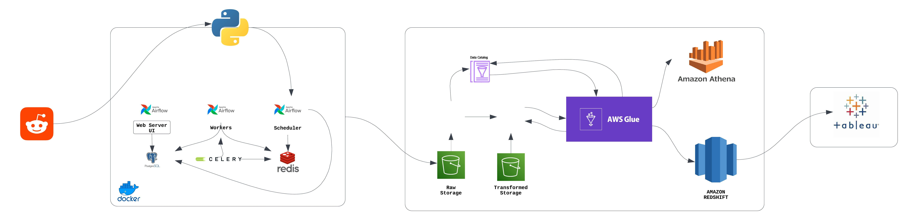
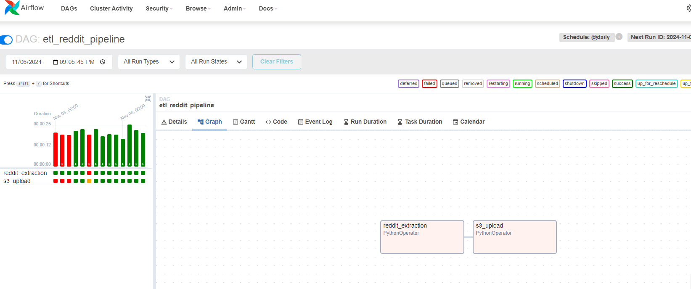
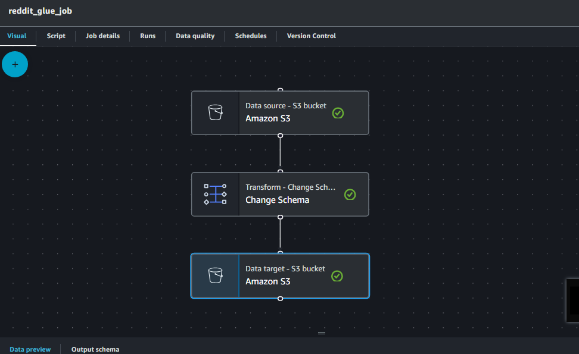

# Reddit Data Pipeline

This project provides a comprehensive data pipeline solution to extract, transform, and load (ETL) Reddit data into a Redshift data warehouse. The pipeline leverages a combination of tools and services, including Apache Airflow, Celery, PostgreSQL, Amazon S3, AWS Glue, Amazon Athena, and Amazon Redshift, to ensure efficient and scalable data management.

## Table of Contents
- [Overview](#overview)
- [Architecture](#architecture)
- [Prerequisites](#prerequisites)
- [Pipeline Workflow](#pipeline-workflow)
- [Screenshots](#screenshots)

## Overview

This data pipeline is designed to:
- **Extract** data from Reddit using its API.
- **Store** raw data in an Amazon S3 bucket via Apache Airflow.
- **Transform** data using AWS Glue and Amazon Athena.
- **Load** transformed data into Amazon Redshift for analytics and querying.

## Architecture

The architecture of the pipeline includes the following components:

- **Reddit API**: The primary data source.
- **Apache Airflow & Celery**: Orchestrates the ETL process and distributes tasks across workers.
- **PostgreSQL**: Temporary storage and metadata management.
- **Amazon S3**: Raw data storage.
- **AWS Glue**: Manages data cataloging and ETL jobs.
- **Amazon Athena**: SQL-based data transformation.
- **Amazon Redshift**: Data warehousing for analytics.

## Prerequisites

- An **AWS Account** with permissions for S3, Glue, Athena, and Redshift.
- **Reddit API Credentials** to access Reddit data.
- **Docker Installation** for containerizing the Airflow environment.
- **Python 3.9** or higher for script execution.

## Pipeline Workflow

1. **Data Extraction**: Extracts data from Reddit's API using Python and stores it locally.
2. **Data Ingestion**: Uploads raw data to an S3 bucket using Airflow.
3. **Data Transformation**: Processes and cleans data using AWS Glue jobs and Athena SQL transformations.
4. **Data Storage**: Saves transformed data in an S3 bucket.
5. **Data Loading**: Loads data into Amazon Redshift for advanced analytics.

## Screenshots

1. **Airflow DAG**:

This screenshot shows the Airflow DAG structure, which manages and schedules the tasks in the ETL process.

2. **AWS Glue Job**:

The AWS Glue job handles data transformation and schema mapping.
